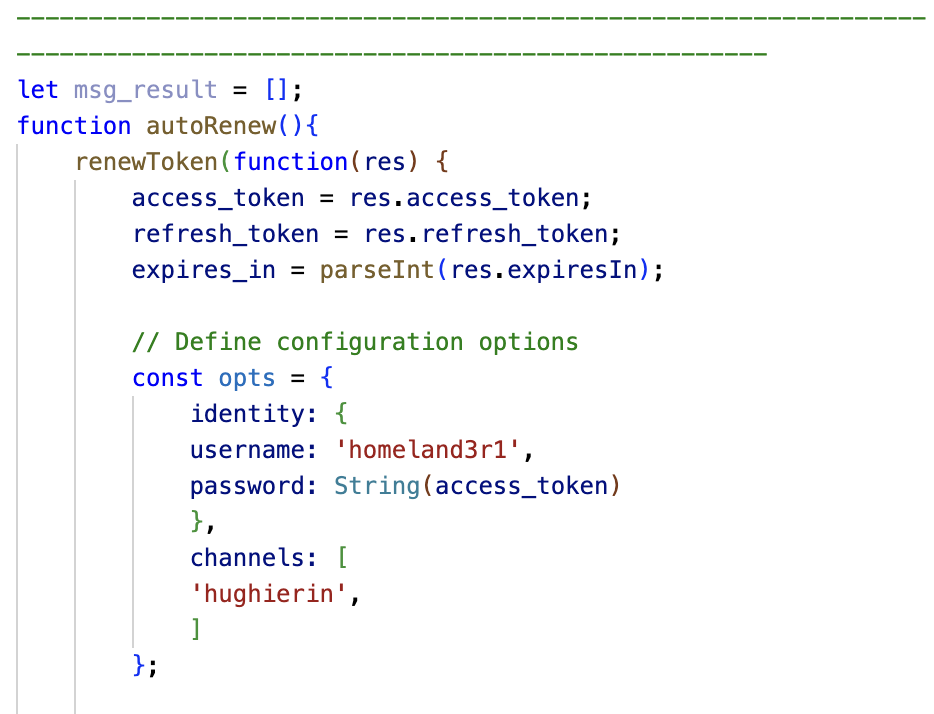

Documentation for Implementing tmi.js for Chatbot and results data extraction bot
===============
### Example Accounts in Use and their respective Registered Bot accounts
1. <b>MollyKim</b>   Userid: #1103563061   Client ID: qhlqnbbq0whady0ic1otaoy6ko4o0f   Client Secret: 7z07tvax1j5ofxggofwn2gzyubgxms
2. <b>Homeland3r1</b>   Userid: #1112905523   Client ID: 4833yyasbekihgj8in8e2hjqco5m16   Client Secret: 80vr3zvtuemc2ljs1f34wj1fz368y7
3. <b>Hughierin</b>

## Step 1.1 : Running the experiment
1. Make sure to enter all the relevant parameters in the bot1args.txt and bot2args.txt files in the bashScript folder and ensure that the token process has been completed for the users to use - Refer to Step 1.2
2. Load all csv files that include a 'text' header for messages to be sent a folder named after the day's 'mm-dd-yyyy' in the 'dataToSendCSV' folder. 
3. Move into the bashScript folder and run the experiment1.sh file using './experiment1.sh "$(cat bot1args.txt)" "$(cat bot2args.txt)" "$(cat pubsubargs.txt)"' after compiling it. 
4. Go to your chatbot's account on a web browser and open up the host channel's chat. Enter '!dice' command to ensure that all bots are enabled and working. Then, '!audit' will trigger the experiment to run. 
5. As a new result file is produced after each file, make sure to check every now and then that a corresponding modData folder is in the results/'mm-dd-yyyy' folder and is being populated by each new data results file. 
6. Once all files are parsed through, enter the 'd' key to start the Json diff process. 

## Step 1.2 : Implicit Flow User Access Tokens
https://id.twitch.tv/oauth2/authorize
?response_type=code
&client_id=<CLIENT_ID>
&redirect_uri=https://localhost:3000
&scope=chat%3Aedit+chat%3Aread

Result of the above:
https://localhost:3000/?code=k7ds3q7ts9vna5g4dw8florfftex44&scope=chat%3Aedit+chat%3Aread

curl -X POST 'https://id.twitch.tv/oauth2/token' \
     -H 'Content-Type: application/x-www-form-urlencoded' \
     -d 'client_id=<CLIENT_ID>&client_secret=<CLIENT_SECRET>&code=<USER_CIDE_FROMABOVE>&grant_type=authorization_code&redirect_uri=https://localhost:3000'

Result of the above:
{"access_token":"jde9l1x6klkqzig4m2pnzhqn4nysc1","expires_in":14832,"refresh_token":"54uq7b3b6wivu7h2e4gdgxeexwb473k70jocnxdt6exexxz9yd","scope":["chat:edit","chat:read"],"token_type":"bearer"}

Using the refresh token from the above to implement the chat bot system so thath the user access does not time out. 

## Step 2 : File Responsibilities
1. Bot1.js will be used to implement a data parsing system - this includes the declaration of the different user bots that are repsonsible for the activation account and chat bot account. 

This can be found here: 

2. Bot2.js will be used to extract messages from the target channel. This includes the declaration of a different chat bot user connecting via tmi.js to the same Twitch target channel. This allows us to extract messages from the target channel without extracting those messages that were moderated by AutoMod. This is because the bot1.js monitors the activation user's messages in order to start the chat bot's data parsing. However, bot2.js is essential to grab the messages that are not from the chatbot in bot1.js itself. 

This can be found here in bot2.js file 

3. <b>data.py</b> must be run before the experiment begins. This file takes care of converting the csv files of dataToSend to json, ensures that the dates of each experiment run are recorded, and handles the differences between sent and recieved messages in the channel. 

4. Folders 'dataToSend' and 'results' will house the json datasets that need to be sent and the extracted json to csv file.  
<b>Note: jsons in 'dataToSend' must include a text column that declares the messages to be sent.</b>